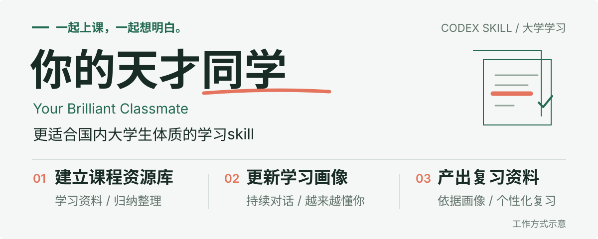

<p align="center">
  
</p>

# 你的天才同学 · Your Brilliant Classmate

作者某老牌中九在读，已有两年深度使用 AI 辅助学习的经验。在这个过程中，我一直希望能有一个真正贴合国内大学体制、大学生需求的 Skill，把课堂ppt资料、课后作业和期末备考连起来。这也是「你的天才同学」的初衷：从最真实的大学学习场景出发，做一个懂你的、帮你的 AI 同学。

[开始使用](#安装与快速开始) · [试试这些提问](#开始一起学习) · [使用前须知](#使用前须知) · [邮件反馈](mailto:vege53762@gmail.com)

## 三步走：建立资源库，更新画像，产出复习资料

**建立课程资源库 → 持续更新用户画像 → 根据画像产出个性化复习资料**

先了解这门课学什么，再通过平时的交流逐步了解你学得怎么样。到了期末，把课程资源和你的学习画像结合起来，产出贴合考试要求、也贴合你个人难点的复习资料。

### 01 / 学习归纳资料，建立课程资源库

你提供教材、课堂 PPT、小测等资料，天才同学会阅读、核对和归纳，把分散的材料整理为这门课的**课程资源库**：包括资料索引、知识点之间的联系，以及有依据的课堂重点。

后续答疑和复习都从这个资源库出发，沿用教材和老师的符号、方法与约定，并能回到相关原文核对。

| 你提供 | 天才同学如何使用 |
| :--- | :--- |
| **教材电子版** | 建立章节索引，归纳定义、公式、适用条件、例题与知识点联系。 |
| **课堂 PPT** | 对照教材梳理课堂内容，保留老师的符号、方法与强调。 |
| **课堂小测** | 将题目对应到知识点与考查内容；实际作答也可用于后续更新画像。 |

### 02 / 在持续对话中，不断更新用户画像

资源库让天才同学了解这门课，**用户画像让它越来越了解你**。这里的画像，是结合你的提问、解题思路、作答表现与后续练习，持续整理的学习情况：哪些知识点已经有掌握证据，哪些仍需核实，常见错因是什么，哪些问题已在后续练习中得到改善。

**答疑时，对照原文，也记录你卡在哪里。** 先检索课程资源库，沿用课程中的符号和方法讲解，并附上相关知识点的原文截图与准确页码或幻灯片编号。你的问题及对应知识点会进入学习记录。

**检查作业时，通过思路了解错因。** 围绕存疑步骤追问“为什么选这个公式”“如何理解这个条件”，区分概念理解、适用条件、方法选择、审题和计算等具体问题。确认错因后，再结合原文纠正并安排练习。

这些学习记录按课程保存到**本地学习数据库**，作为更新画像的依据。随着新作答和后续表现积累，画像也继续更新，让天才同学逐步知道你需要补什么、哪些地方已经进步。

> 提问不等于没有掌握。画像会区分待确认的问题与已确认的错因，并结合实际作答和后续表现更新判断。

### 03 / 根据用户画像，产出个性化复习资料

到了期末，天才同学会读取课程资源库与已有画像，结合老师的考试范围、考试形式和你的可用时间，产出适合你当前学习情况的复习资料：

- **复习计划：** 在考试范围内安排复习顺序、每日任务和时间，优先处理重要且仍未解决的问题。
- **知识点与薄弱点清单：** 对照课程重点，整理你曾经卡住的地方、已确认错因、相关原文依据与纠正思路，并标明尚未检查的内容。
- **针对性练习：** 围绕需要巩固的知识点安排适合这门课的练习，通过新作答检验掌握情况。

复习中的作答会继续进入学习记录，用于更新画像和调整后续资料。平时积累越充分，期末就越有依据地把精力放在你需要巩固的地方。

## 安装与快速开始

### 1. 安装 Skill

下载本仓库并解压，或克隆到本地。将完整的 `your-brilliant-classmate` 文件夹放入用户技能目录，保留 `references/`、`scripts/` 和 `agents/`。

| 系统 | 用户技能目录 |
| :--- | :--- |
| Windows | `%USERPROFILE%\.agents\skills\` |
| macOS / Linux | `~/.agents/skills/` |

<details>
<summary>查看安装后的目录结构</summary>

```text
~/.agents/skills/
└── your-brilliant-classmate/
    ├── SKILL.md
    ├── agents/
    ├── references/
    └── scripts/
```

</details>

在 Codex 中输入 `$`，选择“你的天才同学”，或在消息中使用 `$your-brilliant-classmate`。若尚未出现，重启 Codex 后再查看。

安装位置与调用方式参见 [Codex 官方技能文档](https://developers.openai.com/codex/skills/)。

### 2. 准备课程资料与运行环境

打开用于这门课的工作目录，提供教材 PDF、课件、课程大纲或作业。**从当前章节开始也可以**；有考试范围或评分标准时，一并提供。

随附工具需要 Python 3，资料处理分别使用 PyMuPDF、python-pptx 和 Pillow。环境尚未提供这些依赖时，在用于运行工具的 Python 环境中安装：

```shell
python -m pip install pymupdf python-pptx Pillow
```

### 3. 发起第一次学习

```text
使用 $your-brilliant-classmate。这是我的教材、老师的课件和课程大纲。
请先阅读归纳当前章节的资料，建立课程资源库与知识点索引，
梳理有依据的学习重点，说明已检查的范围，并为后续更新学习画像建立记录。
```

## 开始一起学习

### 作业卡住了

```text
使用 $your-brilliant-classmate。我在这道作业题上卡住了。
请先了解我的解题思路，再帮我检查具体步骤，沿用教材和老师的方法解释，
展示相关原文截图并标注页码，将我的思路、已确认错因与后续表现记录下来，
作为更新这门课学习画像的依据。
```

### 期末还有两周

```text
使用 $your-brilliant-classmate。距离这门课的期末考试还有两周，每天能学一小时。
请读取课程资源库和已有学习记录，整理当前学习画像，结合考试范围，
为我产出个性化复习计划、知识点与薄弱点清单，以及针对性练习。
优先巩固已确认的问题，并根据我的新作答继续更新画像和后续复习资料。
```

### 接着上次继续学

打开原来的课程工作目录；如果换了目录或对话，提供保存的课程文件路径，便于读取资源库与学习记录，继续更新画像。不同课程的资料和学习记录分别保存。

## 使用前须知

- **原文截图需要可访问的源文件。** PPT/PPTX 需先用可用的演示文稿工具导出为 PDF 或图片；也可以直接提供导出的 PDF。
- **扫描版教材取决于识读能力。** 检索效果受可用 OCR 和页面识读能力影响，部分索引不代表已经学习整本教材。
- **继续学习需要原来的课程目录。** 新对话不保证能访问旧附件；持久记录依赖实际保存的本地文件。
- **重点与错因需要证据。** 以课程材料、老师的明确要求和实际作答为依据，区分待确认的问题与已确认的结论。
- **个性化依赖已有学习记录。** 如果尚未积累个人作答与错因记录，会先根据课程资料和诊断练习建立画像，再逐步调整复习资料。

## 欢迎反馈

欢迎分享你在使用「你的天才同学」时遇到的问题、改进建议，以及实际学习中的体验。

联系邮箱：[vege53762@gmail.com](mailto:vege53762@gmail.com)
